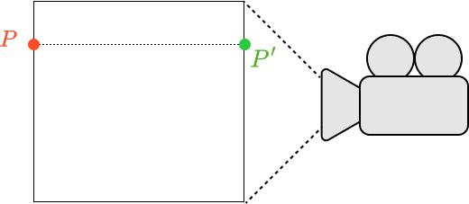

> I won't be impressed with science until I can download a waffle.
>
> <footer>Sean Gabay</footer>

---

The ability to see something three dimensional on a two dimensional screen is astounding to me. We just moved up one dimension; an entire 3D world can be displayed on a flat surface. After watching 3blue1brown's videos on linear algebra, I began investigating how this projection of three dimensions to two actually worked. Although it can get complicated with the addition of light, shadows, meshes, and reflections, the coordinate projection aspect itself is relatively simple.

We need some way to convert from 3D coordinates of a scene to 2D coordinates on the canvas. There are two ways of doing this, two types of projection - orthographic and perspective. Perspective projection accounts for how depth changes an object's appearance, like parallel lines converging and farther away objects appearing smaller. Orthographic projection is a direct mapping of the object's spatial coordinates to those of the canvas - no depth information is retained in the position of points on the screen. A consequence of this method is that parallel lines in scene space remain parallel when they are projected, which differs from how it works in real life where parallel lines converge. Orthographic projection is simple to implement as we don't have to calculate or change any values, just remap them to canvas space.

*Fig. 1 – Orthographic Projection Diagram*

Here, point $P$ is in 3D space of the scene and has coordinates $(x, y, z)$. Orthographic projection keeps those $x$ and $y$ values as positions on the canvas, which is where point $P'$ lies. $P'$ has coordinates $(x, y)$; since it exists in 2D screen space, there is no $z$ coordinate.

In practice, there will be some conversion between coordinate systems as the camera is taken to be at $(0, 0, 0)$, meaning the center of the canvas is $(0, 0)$ in screen space. However, in SFML and many other graphics frameworks, the screen space origin is located at the top left of the canvas. A simple conversion would be adding the $x$ value of $P'$ to half the screen width to get the coordinate in screen space, while subtracting $y$ of $P'$ from half the screen height (since the positive $y$-axis is downward).

For this experiment with orthographic projection, I made a cube by storing coordinates in an array and setting the position of `sf::CircleShape` objects to each corner's $x$ and $y$ coordinates.

In all modern graphics applications, this conversion is accomplished through matrix multiplication rather than the direct copying coordinates of 3D objects to their 2D representations. There are several advantages to this approach. Graphics cards are optimized at the hardware level for matrix multiplication, making it fast and efficient. The projection matrix can also encode all other kinds of transformations, including rotations, translations, and scaling. A projection matrix is usually 4x4 in dimension, allowing the full amount of transformation information to be contained. To multiply this matrix by a three dimensional coordinate, the 3D coordinates must be put into a 4x1 vector, which is made simple by converting 3D spatial coordinates to <i>homogenous coordinates</i>. Homoegenous coordinates add a fourth value $w$ such that converting from homogenous to Cartesian coordinates is given by dividing $x$, $y$, and $z$ by $w$: 

$$
(x, y, z, w) \rightarrow(\frac{x}{w}, \frac{y}{w}, \frac{z}{w})
$$

Since in projecting points orthographically all that is done is copying the $x$ and $y$ values, $w$ is not needed and can just be set to $1$. A simple orthographic projection matrix would then be given by

$$
\begin{bmatrix}
1 & 0 & 0 & 0 \\
0 & 1 & 0 & 0 \\
0 & 0 & 0 & 0 \\
0 & 0 & 0 & 0 \\
\end{bmatrix}
$$

Multiplying this matrix by scene coordinates gives the screen space coordinates we desire:

$$
\begin{bmatrix}
1 & 0 & 0 & 0 \\
0 & 1 & 0 & 0 \\
0 & 0 & 0 & 1 \\
0 & 0 & 0 & 1 \\
\end{bmatrix}
\begin{bmatrix}
x \\
y \\
z \\
w=1 \\
\end{bmatrix}
=
\begin{bmatrix}
x \\
y \\
w \\
w \\
\end{bmatrix}
\rightarrow (x, y, 1)
$$

This is good enough for a simple application like rendering a cube, but for more complicated scenes and more functionality such as clipping and transformations, this matrix can be altered. The underlying principle remains the same, that a point in scene space is projected directly onto the image plane and shown on the canvas.

<iframe width="560" height="315" src="https://www.youtube.com/embed/MxTyektCmtc" title="YouTube video player" frameborder="0" allow="accelerometer; autoplay; clipboard-write; encrypted-media; gyroscope; picture-in-picture" allowfullscreen></iframe>

For more information on orthographic projection and computer graphics in general, I highly recommend <a href="https://www.scratchapixel.com/lessons/3d-basic-rendering/perspective-and-orthographic-projection-matrix/orthographic-projection-matrix" target="_blank">Scratchapixel</a>, which explains these concepts in more depth and detail.

