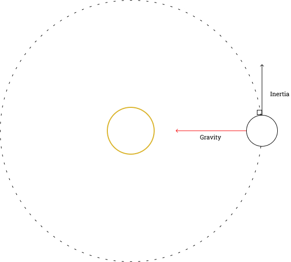

> Gravity is a contributing factor in nearly 73 percent of all accidents involving falling objects.
> 
> <footer>Dave Barry</footer>

---

Gravity is classically one of the four fundamental forces. Yet such a complicated and strange force is expressed simply by an equation derived by Isaac Newton in the 17th century.

$$
F = G\frac{m_1m_2}{r^2}
$$

This equation relates the masses and radii of two objects to the force of gravity attracting them. In a solar system, these objects are the stars and planets, and that is what this simulation will focus on.

In reality, every object attracts every other object due to gravity. However, both to experiment with the simple side of orbital mechanics and reduce the computational load, we can just calculate the forces between the sun and planets and ignore the planet-planet interactions.

Another assumption we can make is that the sun is not affected by the planets' gravitational pull. In our solar system, the sun is about a million times as massive as the Earth, so the Earth's effect on it is comparatively small.

It is convenient to create a planet class that inherits from SFML's CircleShape class. It will hold a mass, velocity vector, and allow use of the inherited position setters and getters, and drawing to the window.

Now that we can store the information about each planet, we can calculate their motion.

Gravity will always attract the planet inward towards the sun. We can start the planet off with some initial velocity, and the center-directed gravitational force and the planet's inertia will result in an elliptical orbit.

Out of the formula for gravity, only one value is unknown, $r$, This is just the distance between the bodies and can be found easily with the Pythagorean theorem.

$$
r^2 = (x_2-x_1)^2+(y_2-y_1)^2
$$

The $G$ term in the formula is a universal constant, equal to around $6.67 \times 10^{-11} \frac{N \cdot \, m^2}{kg^2}$, but since our mass and radius values are not on astronomical scales, this number can be much larger, and experimenting with timestep and mass values led me to just set the $G$ value to $1$, effectively omitting it.

Now we know the magnitude of the force, but we still don't know exactly which direction to apply it in. It should be directed toward the center of the sun, so a convenient way of holding this information in a vector. The x and y components will be the differences in position of the planet and the sun.

$$
\overrightarrow{P} = 
\begin{bmatrix}
\Delta x \\
\Delta y
\end{bmatrix}
$$

The vector $\overrightarrow{P}$ now indicates which direction to apply the force in, but we still don't know the force to be applied to each component ($x$ and $y$), only the overall magnitude. To find this, we can normalize vector $\overrightarrow{P}$, then multiply it by the force. This will scale the force to the appropriate value for each component, allowing us to easily update the velocity from there.

$$
\hat{P} = \frac{\overrightarrow{P}}{||P||}
$$

$$
\overrightarrow{F} = F \cdot \hat{P}
$$

Note that in the second equation the unit vector $\hat{P}$ is being multiplied by the scalar value $F$ to give the vector $\overrightarrow{F}$.

All that's left now is to change the planet's velocity by the force vector, then change its position by the velocity.

As in other simulations, we can numerically integrate from force using a chosen timestep value, $\Delta t$.

$$
v_f = v_i + a\Delta t
$$

and from velocity to position

$$
s_f = s_i + v\Delta t
$$

Calculating this for each component and setting the new position every frame will make our planet circle the sun!

I then instantiated another planet object to give us an Earth and Mars. Right now they don't interact gravitationally with each other, but that's a project for a different time!

<iframe width="560" height="315" src="https://www.youtube.com/embed/41upORdKy8U" title="YouTube video player" frameborder="0" allow="accelerometer; autoplay; clipboard-write; encrypted-media; gyroscope; picture-in-picture" allowfullscreen></iframe>