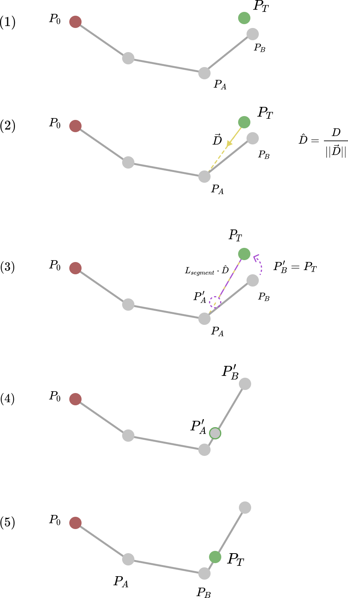

> The most important tool of the theoretical physicist is his wastebasket.
> 
> <footer>Albert Einstein</footer>

---

<i>The original paper on the technique described here was written by Andreas Aristidou and Joan Lasenby and can be accessed <a href="http://andreasaristidou.com/publications/papers/FABRIK.pdf" target="_blank">here</a>.</i>

---
### Background

Kinematics solvers are divided into two main categories: forward and inverse. Forward kinematics attempts to find a target point from a set of conditions, which in this example are joint angles for an arm. This is relatively simple to implement using basic trigonometry. Inverse kinematics, as its name suggests, does the opposite. Given a target point, what set of conditions (i.e., joint angles) will lead to that target point?

Inverse kinematics (IK) is an important problem in fields like robotics, where joint angles must be calculated to move the end of an arm to a known desired location.

Implementing inverse kinematics is not as easy as forward kinematics. Some exact methods use computationally expensive operations that may not guarantee a solution in all cases. However, an algorithm published in 2011 provides a numerical solution that is both fast and easy to implement called FABRIK, which we'll use in this project. FABRIK stands for Forward And Backward Reaching Inverse Kinematics and works by repeatedly iterating forward and backward along the joint-arm system, finding differences in the positions of points and their target points and updating those positions accordingly.

### Algorithm

For an in-depth explanation of FABRIK and how it works, I recommend <a href="https://www.youtube.com/watch?v=UNoX65PRehA" target="_blank">this video</a> by EgoMoose.

FABRIK simplifies the problem of IK by dividing it into multiple smaller problems of points on a line. Each line segment has two points on either end, $P_A$ and $P_B$. It iteratively goes through each point, comparing it to a target point, and updates the position of the previous point to be in the direction of the target point while keeping the same segment length. The first cycles "forwards", reaching out toward the green point from the red point. It then repeats "backwards", reaching from the green point to the red. This is repeated until the difference between the target point and the end point is smaller than some set value.

The basic process for the forward reaching pass is outlined in figure 1.

*Fig. 1 - FABRIK Forward Reaching Pass Outline*

The steps, where $P_T$ is the target point:
1. Find the displacement vector, $\overrightarrow{D}$, from $P_T$ to $P_A$.
2. Normalize vector $\overrightarrow{D}$, so it has a magnitude of one, denoted by $\hat{D}$.
3. Multiply $\hat{D}$ by the scalar length of segment $AB$. Moving along this vector from point $P_T$ is where the new location of $P_A$ will be, denoted by $P'_A$. Move $P_B$ to $P_T$ to get $P'_B$. Segment $A'B'$ has the same length as $AB$.
4. Repeat, setting the new $P_T$ to $P'_A$, the new $P_B$ to the original $P_A$, and $P_A$ to the next point down the arm.

The process is almost the same for the backward reaching pass. At the end of the forward pass, the first point on the left will have moved from the original $P_0$, according to the algorithm. If you want the end to move, this is fine, but for a stationary point like in our simulation, another pass is required, this time with $P_T$ set to the original position of $P_0$ and iterating over the points from left to right, or whatever the opposite direction of the forward pass happens to be. It is therefore necessary to keep track of the original $P_0$, so I made a separate variable to hold its coordinates.

### Implementation Notes

In this implementation, the points and segments are stored in C++ vectors. I created a segment class that contains two pointers, one for either end of the segment.

Before we can actually call the forward and backward pass functions, we have to make sure the target point is actually reachable, simply by checking if

$$
\sum_{i=0}^{n}{L_{seg}(i)} \geq \sqrt{(x_T-x_0)^2+(y_T-y_0)^2}
$$

where $(x_0, y_0)$ and $(x_T, y_T)$ are the coordinates for the end and target points, respectively, and $L_{seg}(i)$ is the length of the $i$'th segment. This relates the total length of the arm to the distance it has to reach.

If the point is reachable, then we can begin the cycle of forward and backward passes. These run in a `while` loop until the distance between the target end point and end of the arm is smaller than some tolerance, which seemed to work well when I set it to one.

If the point is not reachable, then we can still make it reach in the direction of the target point. I did this by finding the displacement vector between the first and target points, normalizing it, then multiplying by the total length of the arm. This results in a vector with its direction pointing to the target and its length that of the arm. Adding this vector's components to the coordinates of the first point will result in the farthest reachable point in the direction of the original target point. We can now use this new point and run the algorithm with it as the target point.

### Conclusion

A full implementation can add features such as functionality in 3 dimensions, contraints on joint angles, or multiple end effectors instead of a single arm. These are all important in real-world applications, including robotics and animation. You could also increase the number of points on the arm, which would result in a more noodle-like structure as opposed to the rigidity of long arm segments. The FABRIK algorithm is simple and runs with fewer iterations and is more computationally efficient than many others, and was a great project to implement.

<iframe width="560" height="315" src="https://www.youtube.com/embed/L7OX43yc_bw" title="YouTube video player" frameborder="0" allow="accelerometer; autoplay; clipboard-write; encrypted-media; gyroscope; picture-in-picture" allowfullscreen></iframe>