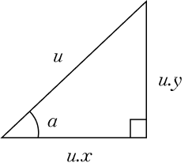
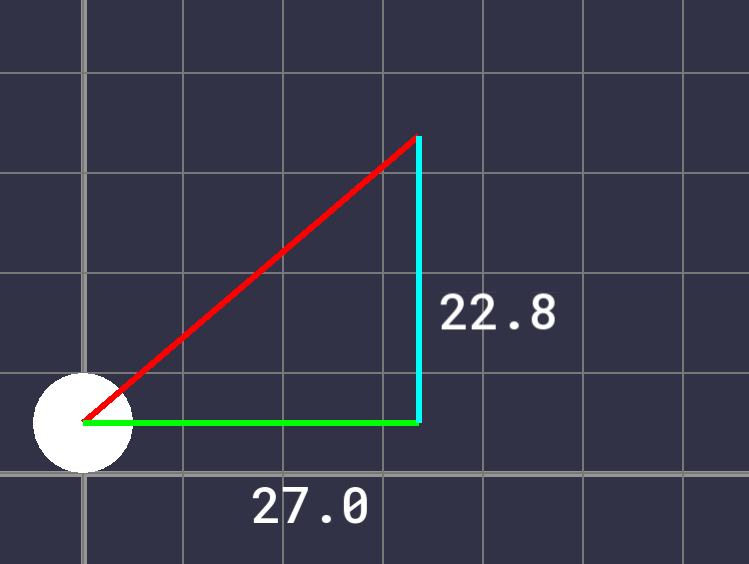
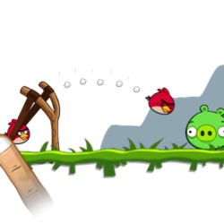
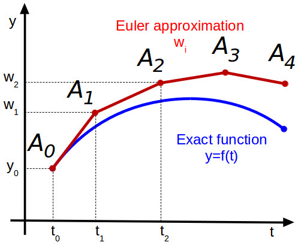
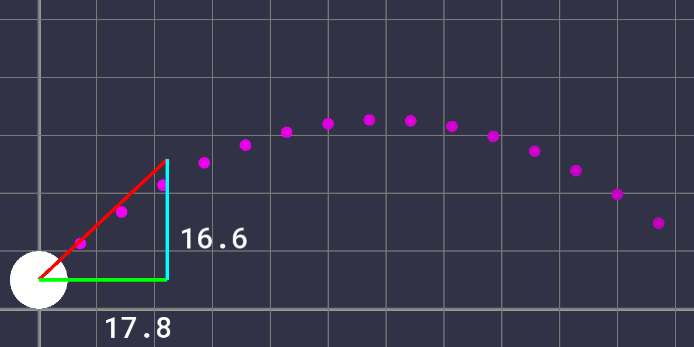

> Physics is really nothing more than a search for ultimate simplicity, but so far all we have is a kind of elegant messiness.
> 
> <footer>Bill Bryson</footer>

---

The key to generalizing kinematic relationships to higher dimensions is to break each dimension of a problem into multiple one-dimensional problems. Since each dimension can be thought of as having independent position, velocity, and acceleration, complex kinematics problems can be greatly simplified.

In the two-dimensional case, position, velocity, and acceleration can all be split up into horizontal and vertical components. Here, the vector $\vec{u}$ is shown with its corresponding $x$ and $y$ components.


*Fig. 1*

In our program, $\vec{u}$ will be the velocity vector of the ball. The angle $a$ is the initial direction of the ball's trajectory. Each component of $\vec{a}$ is controlled by the user's mouse position. Since each component of the velocity is known, they can each be solved as one-dimensional problems, and the ball's position can be updated according to each one. However, since we want to display the direction and magnitude of the initial velocity as an arrow on screen, these two values must be found.

The trigonometric ratios between sides of the right triangle formed by the velocity components can be used to solve for the angle $a$. The Pythagorean theorem can be used to solve for the hypotenuse of this triangle, also known as the magnitude and denoted by $\|u\|$.

$$
\tan{a} = \frac{u.y}{u.x}
$$

$$
a = \arctan{\frac{u.y}{u.x}}
$$


$$
(u.x)^2 + (u.y)^2 = \|u\|^2
$$

$$
\|u\| = \sqrt{(u.x)^2 + (u.y)^2}
$$

In C++ there is a helpful function that will perform the last calculation for us, taking in the two sides as parameters and returning the length of the hypotenuse.
```cpp
trajectoryMagnitude = std::hypot(vComponents.x, vComponents.y);
```

From this information, we can set the sizes, positions, and rotations of the rectangles that will display the ball's velocity and its components and add some text, resulting in the following.


*Fig. 2*

Right now nothing else will happen – the ball can't move. To add movement, we need to know the equations of motion to solve for each timestep. To find these equations, we can start from acceleration and integrate repeatedly until we get an expression for position. Since our ball is effected by gravity, which is constant, its acceleration in the vertical direction is constant. In the horizontal direction, there is no acceleration (assuming no air resistance) since gravity only acts downward.

$$
a(t) = g
$$

$$
v(t) = \int a(t) \,dt = gt + v_0
$$

$$
s(t) = \int v(t) \, dt = s_0 + tv_0 + \frac{1}{2} gt^2
$$

If there is no acceleration from gravity, as is the case for the horizontal component, the displacement equation is simplified:

$$
s(t) = \int v(t) \, dt = s_0 + tv_0
$$

Now that the equations of motion are known, we can use the same integration techniques as the purely 1D simulation to solve for the values each timestep. Since there is no horizontal acceleration, the horizontal velocity remains constant.

$$
v_1 \approx v_0 + g\Delta t
\\
s_1 \approx s_0 + v\Delta t
$$

The ball will now fly through the "air" the same way it would in real life. There's one more feature that I'd like to add, a dotted path showing the trajectory reminiscent of games like Angry Birds or Raft Wars.


*Fig. 3*

Since the entire trajectory curve should show up each frame, a convenient way of displaying it is to draw circles on each point in an array. To generate the coordinates of these points is simple, all the math is already done, we can just implement it in a separate function. Using the equation

$$
s(t) = \int v(t) \, dt = s_0 + tv_0 + \frac{1}{2} gt^2
$$

with a larger interval will give us circles that are spread out more along the curve. One thing to note is that we should use the same timestep used during the motion calculation, otherwise, the curve and the ball's actual motion will be different. This is due to the nature of the numerical integration used to advance our simulation. Different timesteps, shown in figure 4 as the spaces between points, will result in different curves. 


*Fig. 4*

To retain the same timestep but still have the points on our trajectory curve spaced apart, I took every multiple of 100 of the timestep and saved those coordinates to a C++ vector, stopping when they went below the ground or outside the screen.

Adding some styles and a gradient gives the following, and that's the simulation complete.

